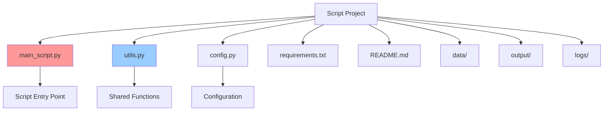

# Python Script Best Practices: Comprehensive Guide for Standalone Scripts (2024-2025)

Python scripts are the backbone of automation, data processing, and utility tasks. This comprehensive guide focuses exclusively on best practices for developing, organizing, and maintaining standalone Python scripts that are executed directly rather than imported as modules or deployed as applications.

## Script Structure and Organization

### Script-First Directory Layout

Unlike library projects, scripts prioritize simplicity and direct execution. The recommended structure focuses on script organization without the complexity of package management.



**Recommended Script Project Structure:**
```
script-project/
├── main_script.py              # Primary script entry point
├── utils.py                    # Shared utility functions
├── config.py                   # Configuration management
├── requirements.txt            # Dependencies (if needed)
├── README.md                   # Script documentation
├── .env.example               # Environment variables template
├── .gitignore                 # Version control exclusions
├── data/                      # Input data files
│   ├── input.csv
│   └── templates/
├── output/                    # Generated output files
│   ├── results/
│   └── reports/
├── logs/                      # Log files
│   └── script.log
└── tests/                     # Simple test scripts
    └── test_main.py
```

### Script Entry Point Patterns

**Simple Script Pattern:**
Create a main script that follows this structure:
- Start with a shebang line to specify Python interpreter
- Add a descriptive docstring explaining what the script does and how to use it
- Import necessary modules including argparse for command-line arguments
- Create a main function that accepts input and output parameters
- Implement proper error handling with try-catch blocks
- Set up logging at the beginning of the main function
- Load configuration settings
- Validate input parameters before processing
- Execute the core processing logic
- Return appropriate exit codes (0 for success, non-zero for failure)
- Use argparse to handle command-line arguments
- Call the main function with parsed arguments
- Exit with the returned code

**Advanced Script with Class Pattern:**
For complex scripts, organize functionality into a class:
- Create a main class that handles the core processing logic
- Initialize the class with configuration settings
- Implement a main process method that orchestrates the workflow
- Break down the process into logical steps (load, transform, output)
- Each step should be a separate method for better organization
- Use the same error handling and logging patterns as the simple script
- The main function creates an instance of the class and calls the process method
- Maintain the same command-line argument handling structure

## Configuration Management

### Environment-Based Configuration

**Simple Configuration Pattern:**
Create a configuration function that:
- Reads settings from environment variables with sensible defaults
- Includes common settings like input/output directories, log levels, and processing parameters
- Validates that required directories exist
- Returns a dictionary with all configuration values
- Provides a separate validation function to check configuration integrity

**Advanced Configuration with Pydantic:**
For more robust configuration management:
- Use Pydantic models to define configuration structure with type validation
- Create separate models for different configuration sections (database, processing, etc.)
- Enable environment variable loading with automatic type conversion
- Implement validation methods to check file paths and create missing directories
- Use field descriptions to document each configuration option
- Create a global configuration instance that can be imported throughout the script

## Utility Functions and Shared Code

### Script Utilities Module

Create a utilities module with these essential functions:
- **Logging setup function**: Configure console and file logging with customizable levels and formats
- **Input validation function**: Check if input files exist and output directories can be created
- **Safe file operation decorator**: Wrap file operations with comprehensive error handling
- **File reading function**: Read file content with proper encoding and error handling
- **File writing function**: Write content to files with error handling and directory creation
- **Backup creation function**: Create timestamped backups of files before modification
- **File size formatting function**: Convert bytes to human-readable format (KB, MB, GB)
- **Progress bar function**: Display console progress indicators for long-running operations

## Error Handling and Robustness

### Comprehensive Error Handling

Implement a robust error handling system:
- **Custom exception classes**: Create specific exception types for different error categories
- **Error handling decorator**: Wrap functions with automatic error logging and optional script termination
- **Retry mechanism**: Implement automatic retry logic for transient failures with configurable attempts and delays
- **Safe mathematical operations**: Create utility functions for operations that might fail (like division by zero)
- **File format validation**: Check file extensions against allowed formats before processing
- **Graceful degradation**: Continue processing when possible even if some operations fail

## Data Processing Patterns

### File Processing Scripts

Create a flexible file processing system:
- **Base processor class**: Define common interface for all file processors
- **CSV processor**: Handle CSV files with pandas, generate summary statistics, and save results as JSON
- **Text processor**: Process text files to count words, unique words, and file statistics
- **Directory processor**: Automatically detect file types and apply appropriate processors
- **Extensible design**: Easy to add new file type processors by extending the base class
- **Consistent output format**: All processors generate JSON summaries with relevant metrics

## Logging and Monitoring

### Script Logging Best Practices

**Option 1: Standard Python Logging**
Implement comprehensive logging using Python's built-in logging module:
- **Enhanced logger class**: Combine console and file logging with performance tracking
- **Timestamp tracking**: Record start time and calculate execution duration
- **Performance logging**: Track time and memory usage for different processing stages
- **Structured logging**: Use consistent format across all log messages
- **Log file management**: Create timestamped log files in dedicated directories
- **Log level configuration**: Allow different verbosity levels for console vs file output

**Option 2: Loguru (Recommended)**
For simpler, more powerful logging, use the loguru library:
- **One-line setup**: Initialize logging with minimal configuration
- **Automatic formatting**: Built-in beautiful formatting with colors and structured output
- **File rotation**: Automatic log file rotation with size and time limits
- **Exception handling**: Automatic exception capture with full tracebacks
- **Performance tracking**: Built-in timing and performance measurement decorators
- **Cross-platform**: Works consistently across different operating systems
- **Rich output**: Enhanced console output with colors, emojis, and formatting
- **Easy configuration**: Simple API for adding/removing handlers and changing formats

## Testing Scripts

### Simple Testing for Scripts

Create a testing framework for your scripts:
- **Unit test structure**: Use Python's unittest framework with proper setup and teardown
- **Temporary file handling**: Create and clean up test files automatically
- **Mock external dependencies**: Use unittest.mock to isolate functions being tested
- **Test all error conditions**: Verify that invalid inputs are handled gracefully
- **Test successful operations**: Ensure normal operation works as expected
- **Test file operations**: Verify reading, writing, and validation functions work correctly
- **Integration testing**: Test the complete workflow from input to output

## Performance Optimization

### Script Performance Patterns

Implement performance monitoring and optimization:
- **Execution time measurement**: Use decorators to automatically time function execution
- **Memory usage tracking**: Monitor RAM consumption throughout script execution
- **Chunked file processing**: Read large files in manageable chunks to control memory usage
- **Parallel processing**: Use ThreadPoolExecutor for I/O-bound operations and ProcessPoolExecutor for CPU-intensive tasks
- **Worker pool sizing**: Automatically determine optimal number of workers based on system resources
- **Performance monitoring class**: Track and log performance metrics for different processing stages
- **Memory optimization**: Implement generators and streaming for large datasets

## Security Best Practices

### Script Security Patterns

Implement security measures to protect your scripts:
- **Filename sanitization**: Remove dangerous characters and limit filename length
- **Path validation**: Ensure file operations only occur within allowed directories
- **Secure filename generation**: Create unique, unpredictable filenames for sensitive operations
- **Safe file operations**: Validate paths before performing read/write/delete operations
- **Input data validation**: Check data length and scan for potentially dangerous patterns
- **Access control**: Implement proper permissions and directory restrictions
- **Security logging**: Record security-relevant events for audit purposes

## Deployment and Distribution

### Script Distribution Patterns

Create distribution-ready script packages:
- **Package creation function**: Automatically bundle script files with dependencies
- **Requirements management**: Generate or update requirements.txt files
- **Documentation generation**: Create README files with installation and usage instructions
- **Archive creation**: Package everything into zip files for easy distribution
- **Executable script creation**: Add proper shebang lines and set executable permissions
- **Cross-platform compatibility**: Ensure scripts work on different operating systems
- **Installation automation**: Provide clear installation and setup instructions

## Best Practices Checklist

### Script Development
- ✅ Use shebang line (`#!/usr/bin/env python3`)
- ✅ Implement proper argument parsing with argparse
- ✅ Add comprehensive error handling and logging
- ✅ Use type hints for better code clarity
- ✅ Implement input validation and sanitization
- ✅ Create backup mechanisms for critical operations
- ✅ Use environment variables for configuration
- ✅ Implement progress indicators for long-running operations

### File Operations
- ✅ Use pathlib for cross-platform path handling
- ✅ Implement safe file operations with error handling
- ✅ Validate file paths to prevent security issues
- ✅ Use context managers for file operations
- ✅ Implement proper file encoding handling
- ✅ Create backup copies before modifying files
- ✅ Use temporary files for intermediate processing

### Performance
- ✅ Profile scripts for performance bottlenecks
- ✅ Use generators for large file processing
- ✅ Implement parallel processing where appropriate
- ✅ Monitor memory usage for large datasets
- ✅ Use appropriate data structures for the task
- ✅ Implement caching for expensive operations
- ✅ Use streaming for large file operations

### Security
- ✅ Validate all input data
- ✅ Sanitize file names and paths
- ✅ Use secure random number generation
- ✅ Implement proper access controls
- ✅ Log security-relevant events
- ✅ Avoid shell command injection
- ✅ Use environment variables for secrets

### Testing
- ✅ Write unit tests for core functions
- ✅ Use temporary files for testing
- ✅ Test error conditions and edge cases
- ✅ Implement integration tests for workflows
- ✅ Use mocking for external dependencies
- ✅ Test with various input formats
- ✅ Validate output correctness

### Documentation
- ✅ Write clear docstrings for all functions
- ✅ Document command-line arguments
- ✅ Provide usage examples
- ✅ Document configuration options
- ✅ Include troubleshooting information
- ✅ Maintain changelog for updates
- ✅ Document dependencies and requirements

## Conclusion

Python scripts remain essential tools for automation, data processing, and utility tasks. By following these best practices, you can create robust, maintainable, and secure scripts that handle real-world scenarios effectively.

The key principles for successful script development are:
- **Simplicity**: Keep scripts focused on a single purpose
- **Robustness**: Handle errors gracefully and provide meaningful feedback
- **Security**: Validate inputs and protect against common vulnerabilities
- **Performance**: Optimize for the specific use case and data size
- **Maintainability**: Write clear, well-documented code with proper testing

As the Python ecosystem continues to evolve, these practices ensure your scripts remain effective, secure, and maintainable in production environments.